# AlunoOnline

## Visão Geral

AlunoOnline é uma API REST simples desenvolvida em Java com Spring Boot para gerenciar informações de alunos e professores. O projeto organiza os recursos em camadas claras e utiliza convenções do Spring Data JPA para persistência e do Spring MVC para expor endpoints HTTP.

## Objetivo do Projeto

O objetivo é oferecer uma base leve para aplicações educacionais que precisam de uma API para cadastro, consulta e associação básica entre alunos e professores. A arquitetura facilita evolução futura para incluir autenticação, validação avançada e integração com um banco de dados real.

## Tecnologias Utilizadas

- Java 21+ (ou versão compatível definida no `pom.xml`)
- Spring Boot
- Spring Web
- Spring Data JPA
- Maven
- PostgreSQL (banco de dados)
- Docker (para containerização do banco de dados)
- Insomnia (para testes da API REST)

## Estrutura do Código

O projeto é organizado em pacotes conforme as responsabilidades:

- `br.com.alunoonline.api`: pacote raiz da aplicação
- `controller`: contém as classes que expõem os endpoints REST
- `model`: contém as entidades do domínio de aplicação
- `repository`: contém as interfaces de acesso a dados
- `service`: contém a lógica de negócio e orquestração de dados

### Principais Classes

- `AlunoOnlineApplication.java`
  - Classe principal que inicializa a aplicação Spring Boot.

- `AlunoController.java`
  - Controlador REST responsável por endereçar requisições relacionadas a alunos.
  - Exemplo de operações possíveis: criação, listagem, atualização e remoção de alunos.

- `ProfessorController.java`
  - Controlador REST responsável por requisições relacionadas a professores.
  - Exemplo de operações possíveis: criação e consulta de professores.

- `Aluno.java`
  - Entidade que representa um aluno no sistema.
  - Possui atributos como nome, matrícula e relacionamento com professor quando aplicável.

- `Professor.java`
  - Entidade que representa um professor.
  - Contém atributos como nome e área de atuação.

- `AlunoRepository.java` / `ProfessorRepository.java`
  - Interfaces que estendem o `JpaRepository` e provêm operações CRUD automáticas para as entidades.

- `AlunoService.java` / `ProfessorService.java`
  - Camada de serviço que encapsula a lógica de negócio.
  - Responsável por preparar dados, aplicar regras e chamar os repositórios.

## Arquitetura Utilizada

A arquitetura adotada é a arquitetura em camadas tradicional, composta por:

1. Camada de Apresentação (Controller)
   - Recebe chamadas HTTP e encaminha para a camada de serviço.
   - Garante a separação entre protocolo web e lógica de negócio.

2. Camada de Serviço (Service)
   - Implementa regras de negócio e orquestra o fluxo de dados.
   - Evita que a lógica fique espalhada entre controladores e repositórios.

3. Camada de Persistência (Repository)
   - Interface com o armazenamento de dados.
   - Usa Spring Data JPA para abstrair a implementação de CRUD.

4. Modelo/Domínio (Model)
   - Representa as entidades do sistema e seus relacionamentos.
   - Mantém a estrutura dos dados que serão manipulados.

Essa separação garante maior manutenibilidade, testes mais claros e melhor escalabilidade ao evoluir a aplicação.

## Endpoints da API

A API oferece os seguintes endpoints para gerenciar alunos e professores. As capturas de tela das requisições estão localizadas na pasta `imagens/` do repositório.

### Endpoints de Alunos (`/alunos`)

- **POST /alunos** - Criar um novo aluno  
  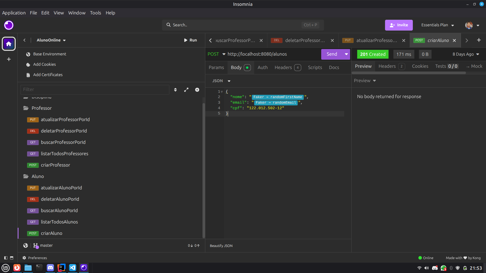  
  *Descrição: Envia um JSON com os dados do aluno para criação.*

- **GET /alunos** - Listar todos os alunos  
  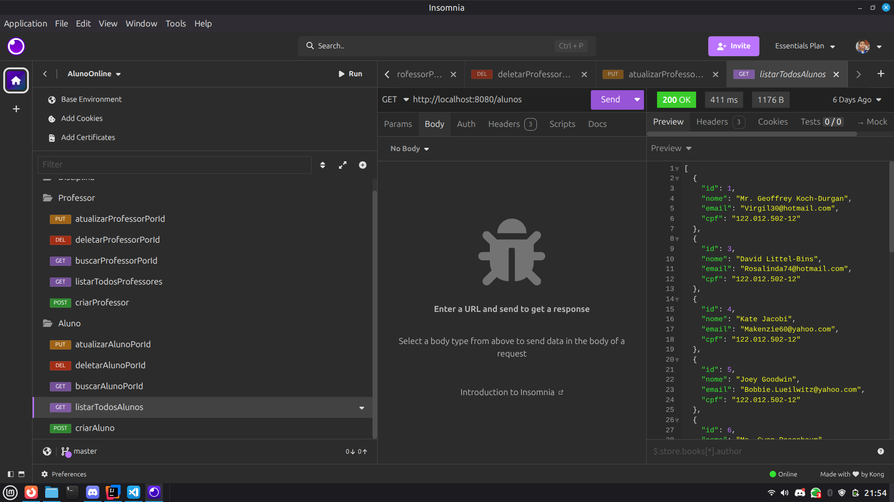  
  *Descrição: Retorna uma lista de todos os alunos cadastrados.*

- **GET /alunos/{id}** - Buscar aluno por ID  
  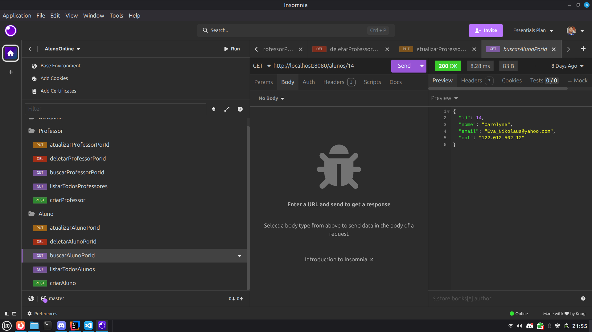  
  *Descrição: Retorna os dados de um aluno específico pelo seu ID.*

- **PUT /alunos/{id}** - Atualizar aluno por ID  
  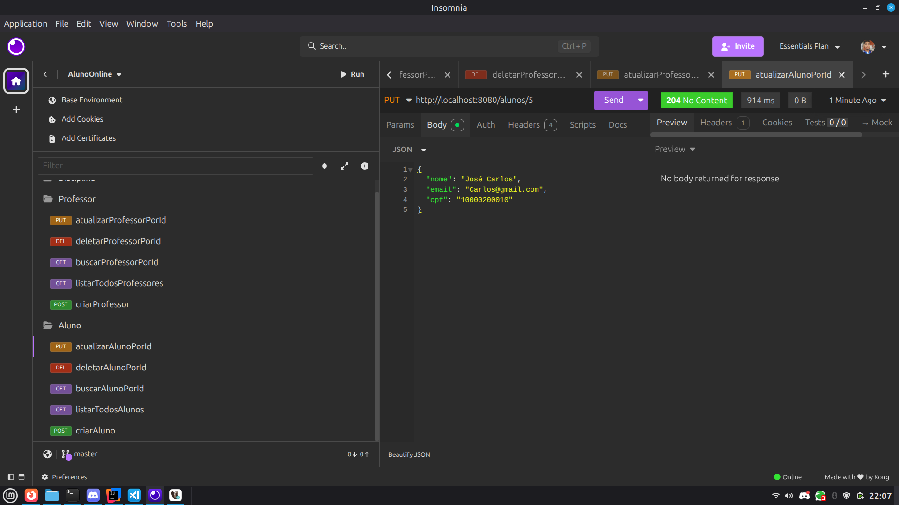  
  *Descrição: Atualiza os dados de um aluno existente.*

- **DELETE /alunos/{id}** - Deletar aluno por ID  
  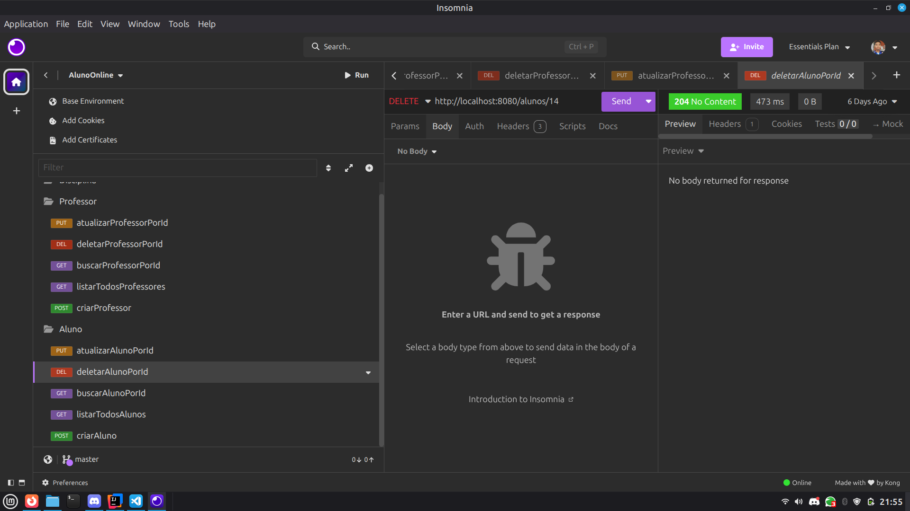  
  *Descrição: Remove um aluno do sistema pelo seu ID.*

### Endpoints de Professores (`/professores`)

- **POST /professores** - Criar um novo professor  
  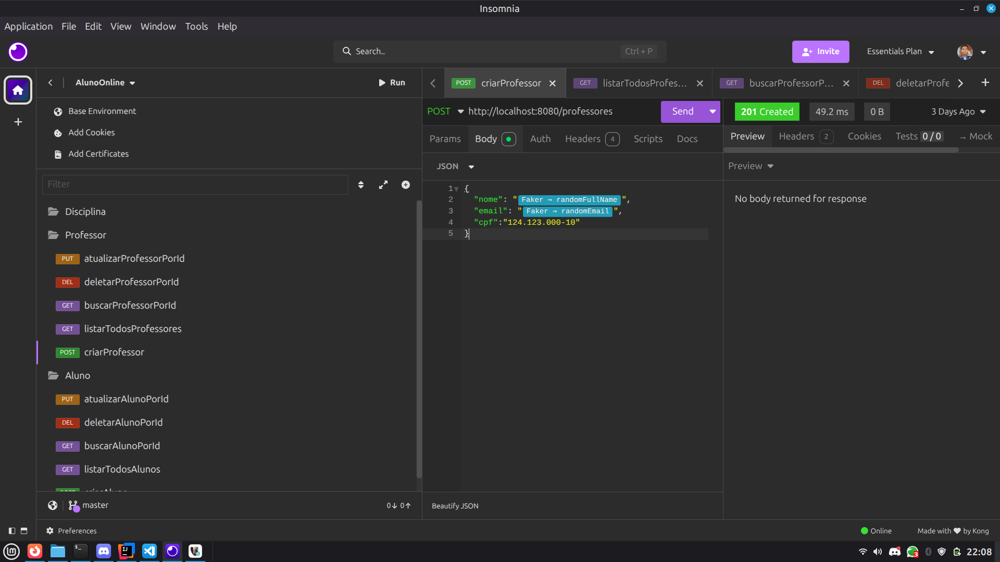  
  *Descrição: Envia um JSON com os dados do professor para criação.*

- **GET /professores** - Listar todos os professores  
  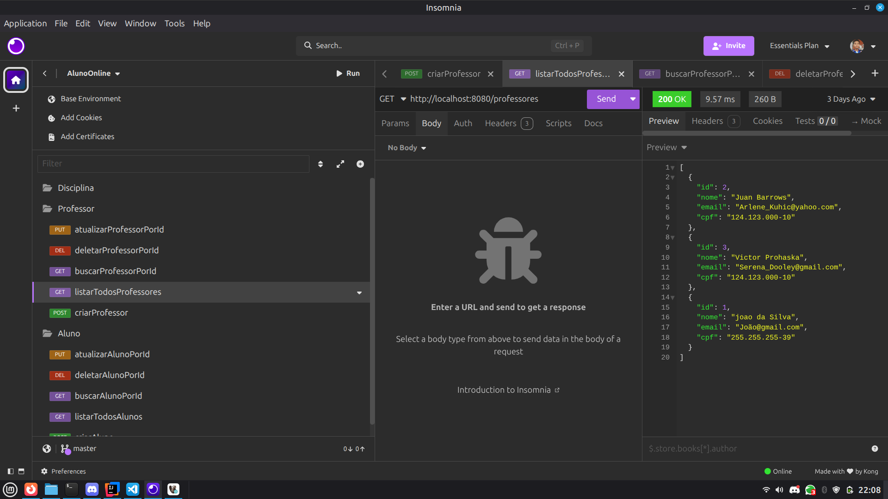  
  *Descrição: Retorna uma lista de todos os professores cadastrados.*

- **GET /professores/{id}** - Buscar professor por ID  
  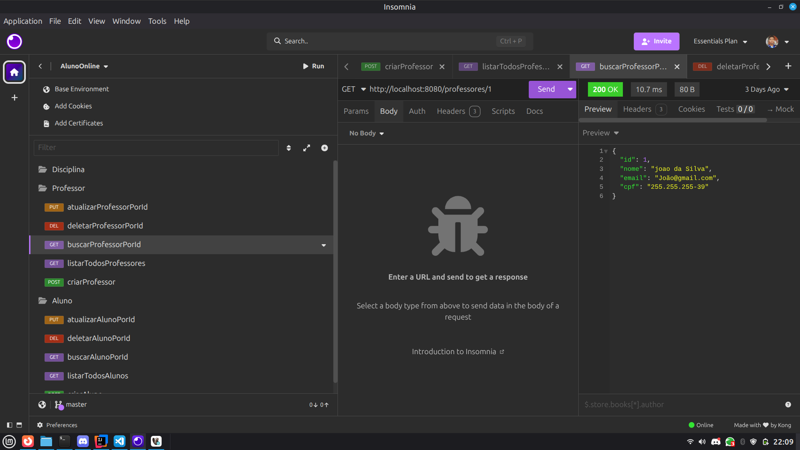  
  *Descrição: Retorna os dados de um professor específico pelo seu ID.*

- **PUT /professores/{id}** - Atualizar professor por ID  
  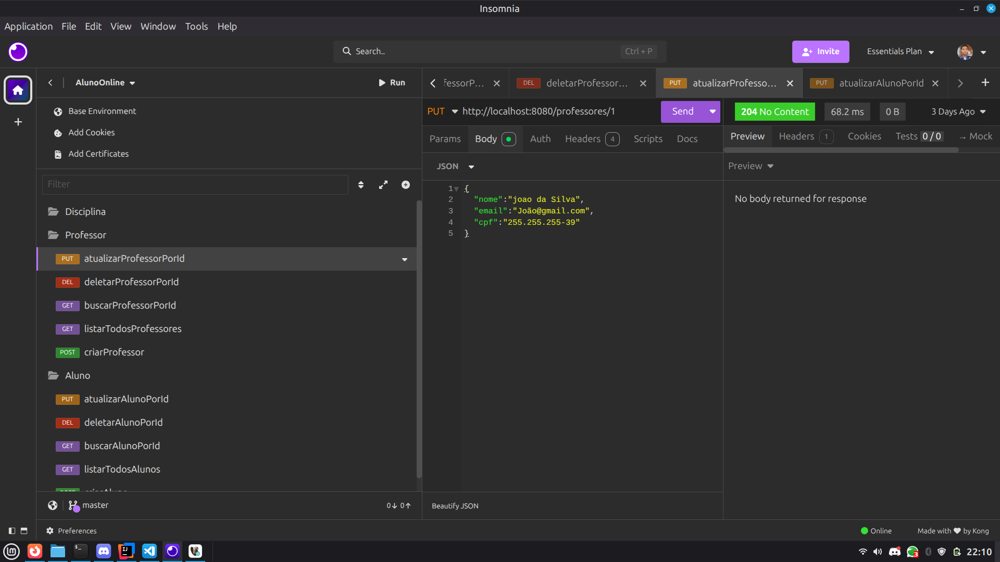  
  *Descrição: Atualiza os dados de um professor existente.*

- **DELETE /professores/{id}** - Deletar professor por ID  
  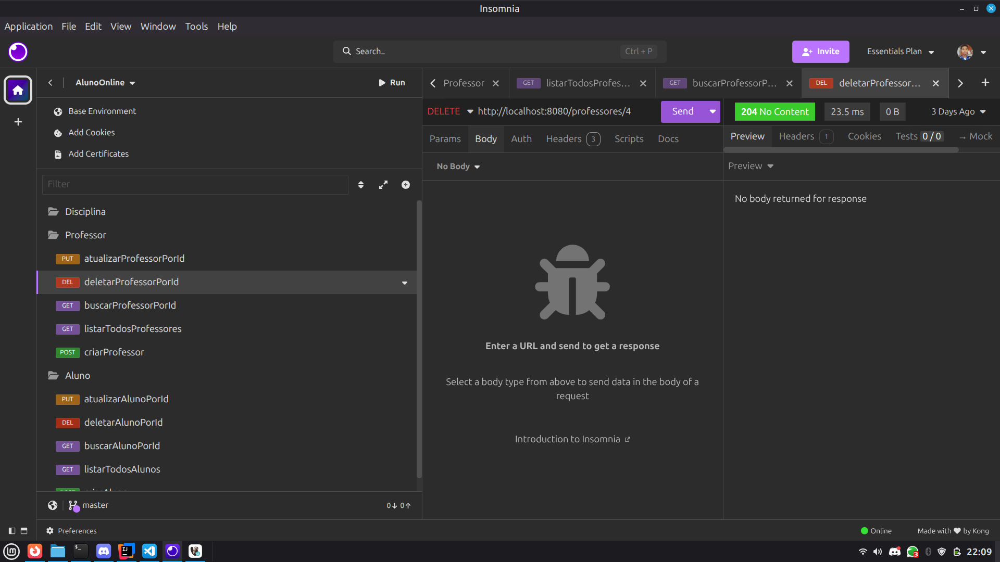  
  *Descrição: Remove um professor do sistema pelo seu ID.*

**Nota:** As capturas de tela devem ser colocadas na pasta `imagens/` na raiz do projeto. Elas podem ser feitas usando ferramentas como Postman, Insomnia ou curl para demonstrar as requisições e respostas da API.

## Banco de Dados

O projeto utiliza PostgreSQL como banco de dados. Abaixo, uma captura de tela do DBeaver mostrando as tabelas criadas automaticamente pelo Hibernate:

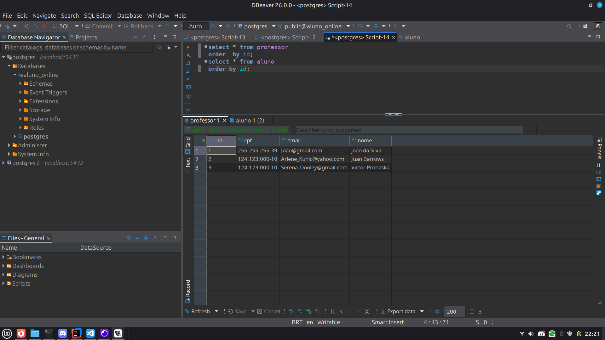
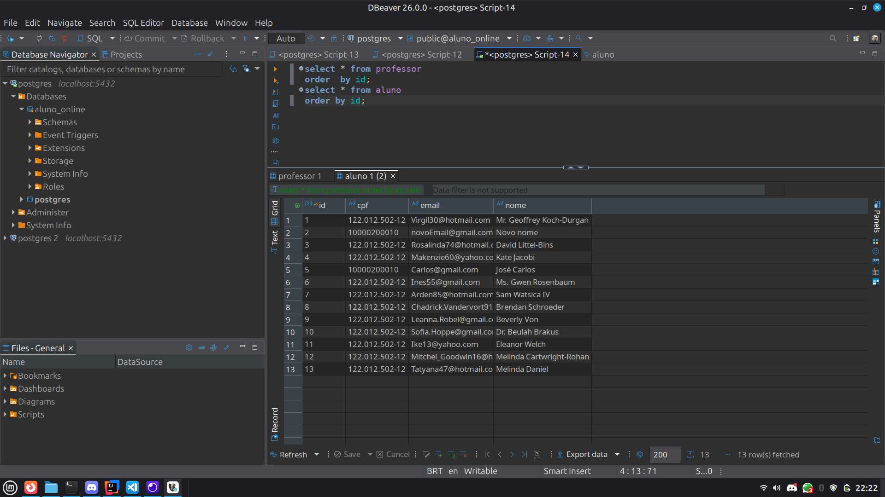
*Descrição: Visualização das tabelas `aluno` e `professor` no DBeaver, mostrando a estrutura e dados de exemplo.*

### Pré-requisitos
- Java 21+
- Maven
- Docker (para executar o banco PostgreSQL)
- Insomnia ou Postman (para testar os endpoints)

### Passos para Execução

1. **Inicie o banco de dados PostgreSQL com Docker:**  
   Se você já tem um container rodando (como o container "projeto" com ID 6c9df31c0e04), certifique-se de que está ativo. Caso contrário, execute:  
   ```bash
   docker run --name projeto -e POSTGRES_DB=aluno_online -e POSTGRES_USER=postgres -e POSTGRES_PASSWORD=postgres -p 5432:5432 -d postgres:13
   ```

2. **Certifique-se de que o Java e Maven estão instalados.**

3. **No diretório raiz do projeto, execute:**
   ```bash
   ./mvnw clean install
   ./mvnw spring-boot:run
   ```

4. **A API estará disponível em `http://localhost:8080`.**

### Testando com Insomnia
- Importe a coleção de requisições ou crie novas requisições para os endpoints listados acima.
- Use Insomnia para enviar requisições HTTP (GET, POST, PUT, DELETE) e visualizar as respostas JSON.

## Observações

O projeto é uma base inicial e pode ser expandido para atender a requisitos reais de sistemas de gestão escolar ou plataformas de ensino.
